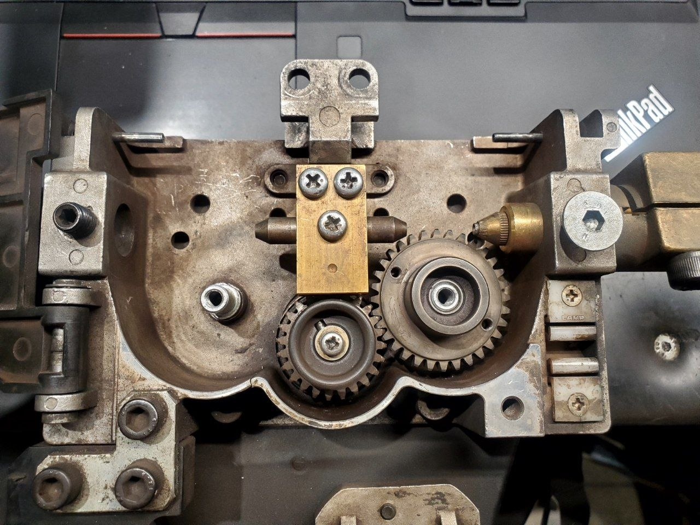
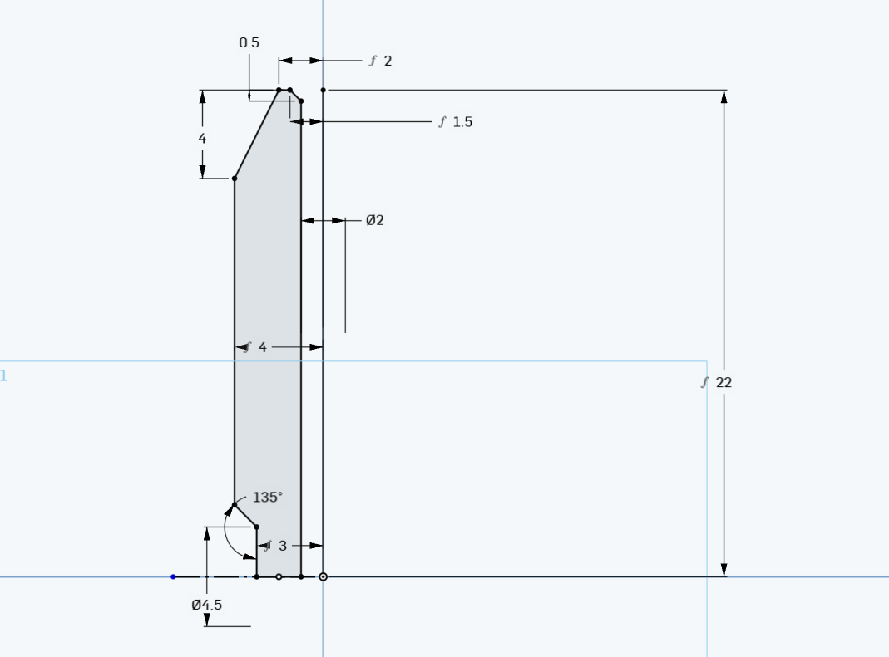

# Wire Guide in between rollers

# Parts:
* 1x `DIN 7985H` M5x4.5 Phillips screw
* 2x `DIN 7985H` M5x20 Phillips screw
* Brass Block
* Guide Tube

# Brass Block

# Guide Tube
Needs to be revolved and mirrored.  
Can be made with lathe from material harder than wire or tool steel (eg. C45)

