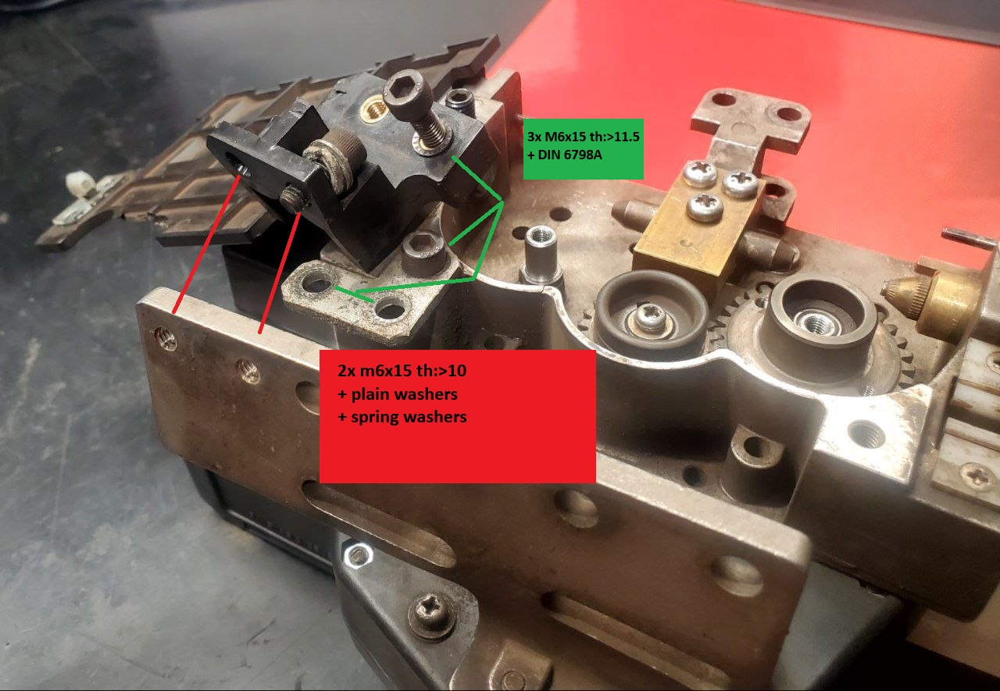
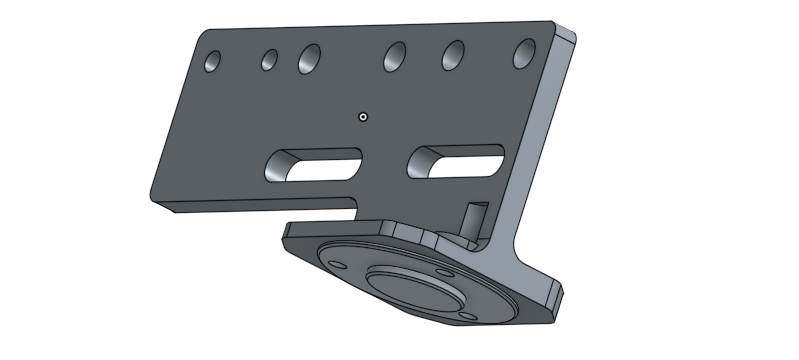
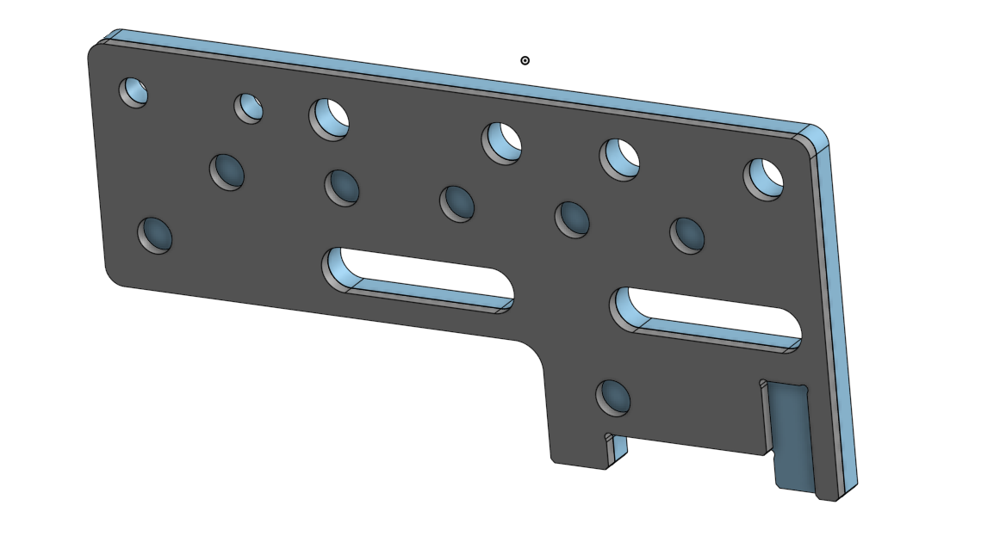
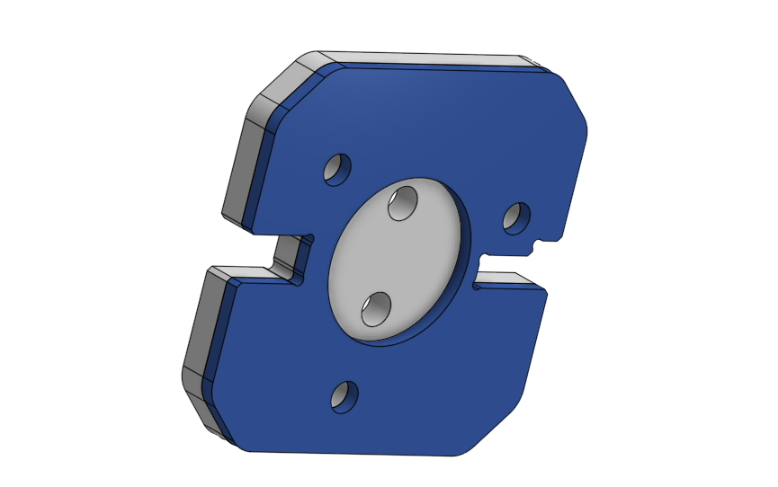
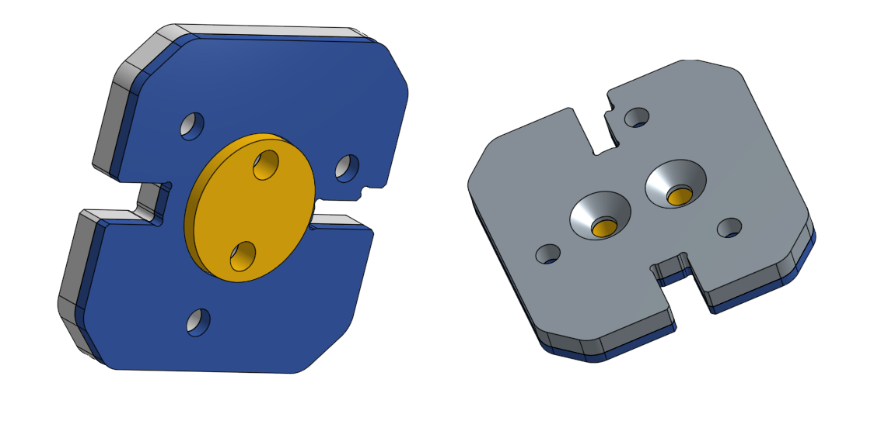
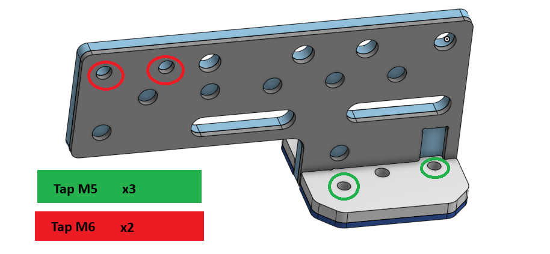

# APU01238 mounting alternative parts:
**Custom Elements:**
* [Insulator](#insulator)
* [Metal Bracket](#bracket-unit-wg-afu01355-alternative)
* [Metal connector plate](#metal-connector-plate)  

**Standard Elements:**
* **5x** `DIN 912` M6x15:
    * **3x** thread >11.5mm
    * **2x** thread >10mm
* **2x** M6 nuts
* **2x** `ANY` plain 6mm washers with OD < 14.9mm
* **2x** 6mm `DIN 7980` spring washers
* **3x** 6mm `DIN 6798A` "spring" washers

# Insulator
Original has threaded inserts but M6 nuts are more popular ammong commoners.

# Bracket unit WG (AFU01355) alternative
Original is `casted` and then `machined`, so alternative is proposed.
You can try recreating this part using Lost-PLA method (like lose wax but w/ 3D printing).
  
## Proposed alternative consists of 5 sheetmetal parts from popular `4` & `2` [mm] thick sheets welded together.
DXF's have already tolerances (0.2-0.3mm).
### Assembly:
First align and weld those to parts together filling additional holes and welding edges. If neccesary grind flat.  
**DON'T weld bottom** `TABS`**.**  
  
  
  
Align and weld edges.  
  
  
  
Align centering circle and weld together, do a chamfer with some kind of drill if necessary. Original thought was to weld 3.2mm TIG wire but not everyone has 3.2mm TIG wire.
  

Finnish by tapping some holes & welding it together and grinding.
  

# Metal connector plate
Recommended to add fillets for laser cuting.

