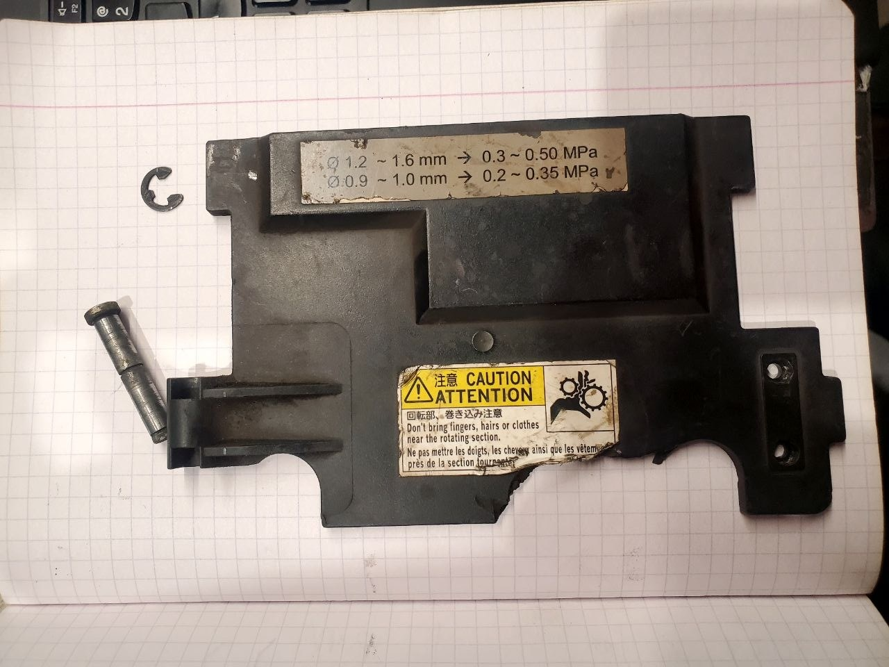
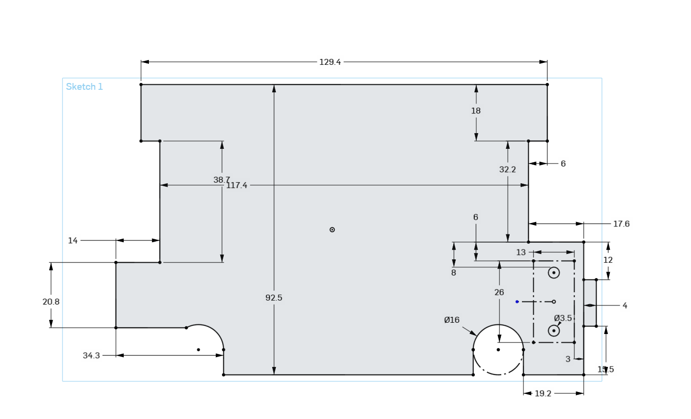
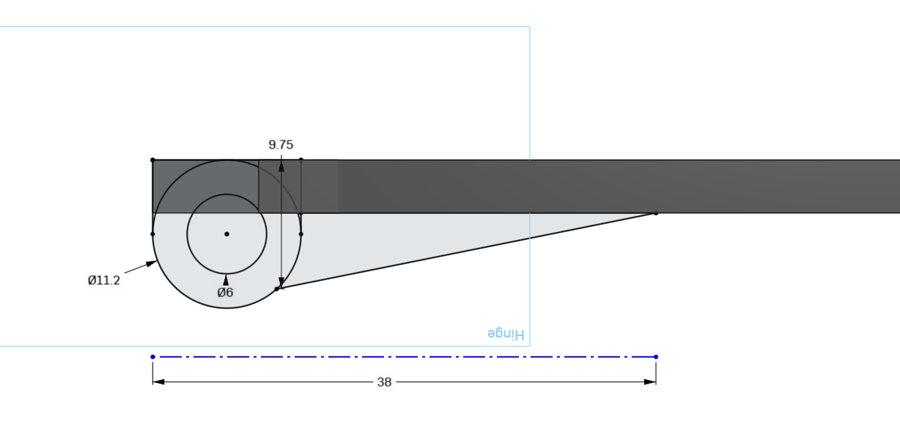
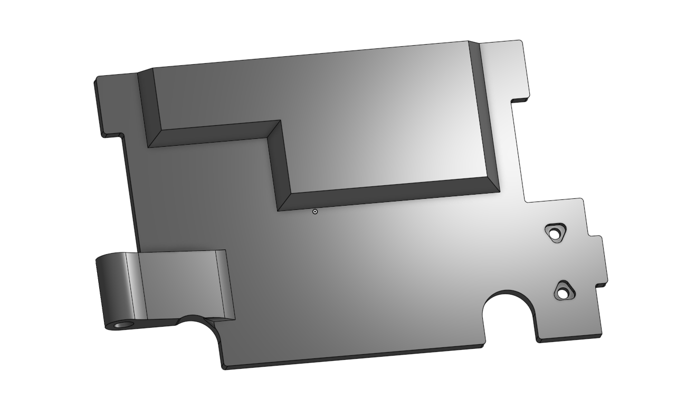
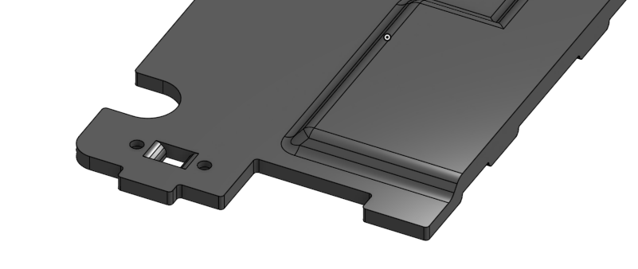
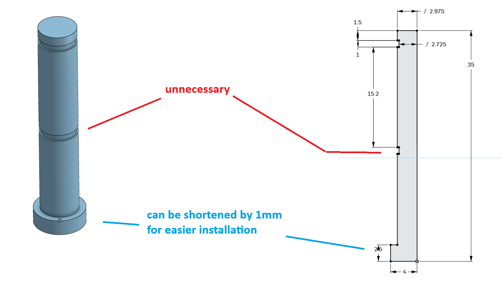

# Panasonic Wire Feed Unit: `WGIII/APU01238`
***Available on*** [Onshape](https://cad.onshape.com/documents/fc67ad3c9c1f68b02d99dc8a/w/f257942ea42ffc9f7acd28aa/e/a838ed4791a7bb28b46b23de)

## Door

Consists of **one** element, but as you can see `it` also requires:
* [magic pin (click to go to it's section)](#door-pin) - can be made from soft material, even from plastic if needed
* magic Seager E-Clip:
  * outer diameter: 11mm
  * inner diameter: 5.20-5.50mm
  * thickness: 0.7mm (up 1.0mm)

### How does proposed alternative look like?

As you can see cuts for M2.5 nuts are triangular to cut accelerate/decelerate ops. for faster printing. Those nut don't get fasten enough to maximize contact area.

#### 3D printing friendlier version

## Door pin

Pin can be made from soft material on lathe or even plastic, but soft steel or aluminum is recommended.

## Door Latch
When printing using `FDM planar 3D printer`:  
* use 100% infill
* orient this on the side
* use support
* material: PP (chemical resistacne) or PCTG - for better layer adhesion and UV resistance

### Parts:
1. 2x M2.5x5.6mm Phillips flat-head contersink machine screws
2. 2x M2.5 Nuts: Wrench 5mm
3. PP or PP-like body

### Anatomy
As you can see it's profile resembles B-Plug of which you may have printed a lot of, but this is thin be careful with it. And stick to a `6mm dimention` not `R5.47`.  
Circle/hole in center `(3mm one)` is not needed because the latch does not squish .

#### 3D printing friendlier version

