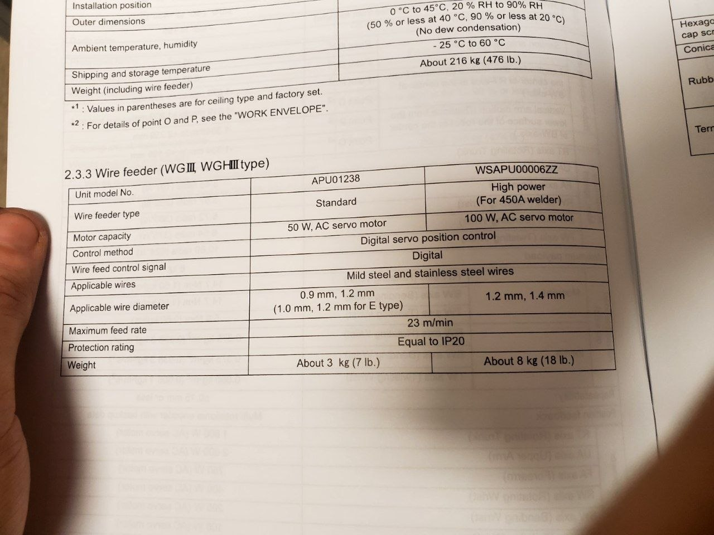
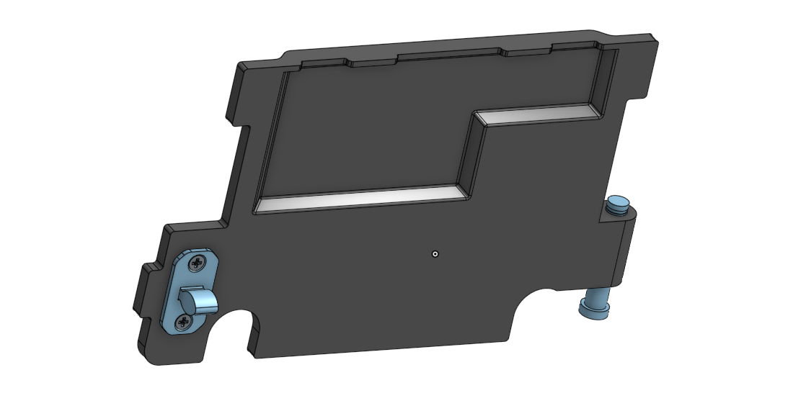
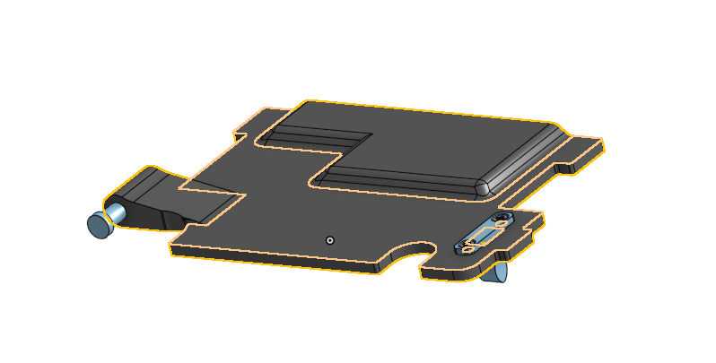
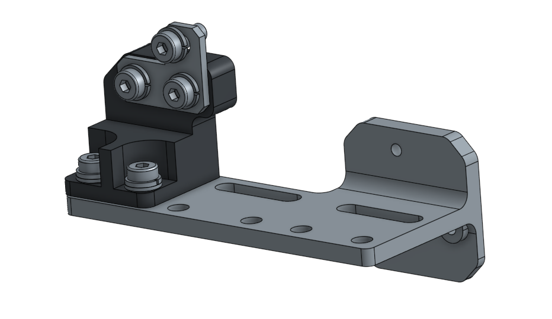
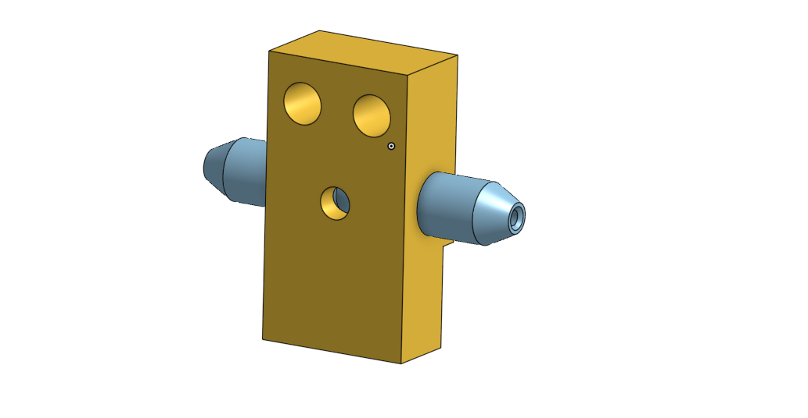

# Panasonic Wire Feed Unit: `WGIII/APU01238`
***Available on*** [Onshape](https://cad.onshape.com/documents/fc67ad3c9c1f68b02d99dc8a/w/f257942ea42ffc9f7acd28aa/e/a838ed4791a7bb28b46b23de)

# What alternatives/spares does this repo provides

## Doors (2 variants):
Doors are not sold themselve you normally need to buy whole new `Wire Feeder` (or just not sold by Valk Welding B. V.)  
Price of those Doors was seen on EBay with 60$ price (used).
* Body: 2 variants
* Latch: 2 variants
* List of components like `seagers` and so on...
* Pin drawings  

## Mount:
* Metal bracket: classic & sheet metal alternative (2&4 mm sheets)  
* Insulator
* Metal L-profile seen below
* OFC: list of standard components

  

## Inside wire guide right between the rollers
* Brass block drawings
* Guide tube dimensions
* Used screws  

  
